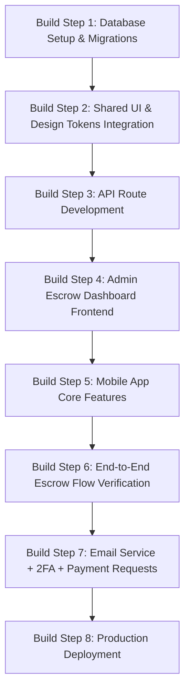

# Implementation Plan — ORTHO-PAY Escrow Payment Platform

This implementation plan outlines the build sequence, database schema, backend API routes, frontend layouts, mobile screens, and deployment strategy for **ORTHO-PAY** (Escrow Payment Intermediary).

ORTHO-PAY is an escrow payment platform that mediates between senders and receivers. Every payment flows through an admin-approved escrow hold: the sender commits funds, the admin verifies and approves, and the receiver gets paid. Users identify each other with a unique **$SIVA tag** (e.g. `$alice`) — similar to a Cash App $Cashtag — which serves as both the user handle and the platform's currency identity. All transactions are in **USD ($)** only. ORTHO-PAY operates in **England** and the **USA**.

The visual identity is a clean, modern fintech product design inspired by Cash App. The design system lives in `ORTHO-PAY-app/src/ui/`.

---

## Technical Stack & Architecture
- **Monorepo Structure**:
  - `apps/mobile/` — React Native (Expo, TypeScript, Zustand, TanStack Query)
  - `apps/admin/` — Next.js (TypeScript, App Router, React)
  - `packages/ui/` — CSS/TypeScript tokens and component styles (source of truth is `ORTHO-PAY-app/src/ui`)
  - `supabase/` — Database migrations, RLS policies, storage bucket configurations, and seed scripts.
- **Database**: Supabase PostgreSQL + Supabase Auth.
- **Hosting / Services**: Vercel (Next.js Dashboard + Route Handlers), Supabase (PostgreSQL, Storage, Realtime).
- **Currency**: USD ($) only across the entire platform.
- **Regions**: England (UK) and USA.

---

## 0. Product Model — Escrow Mediation

ORTHO-PAY is an **escrow-first** payment platform. Unlike peer-to-peer transfer apps where money moves instantly, every ORTHO-PAY payment passes through an admin-gated escrow hold:

1. **Sender** initiates a payment to a receiver's `$SIVA tag` and commits funds (funds are locked/held).
2. **Admin** reviews the held payment in the Escrow Queue and either **approves** or **rejects** it.
3. On **approval**, funds are released from escrow and credited to the receiver's wallet.
4. On **rejection**, funds are refunded to the sender's wallet.

This model makes ORTHO-PAY a trusted intermediary for buyer-seller transactions, marketplace payments, and any scenario where both parties need assurance before money changes hands.

### SIVA Tag System
- Every user gets a unique `$SIVA tag` at registration (e.g. `$alice`, `$bob`).
- The `$` prefix is the ORTHO-PAY brand symbol — analogous to Cash App's `$Cashtag`.
- Users search and send money by `$SIVA tag` — no phone numbers or account numbers needed.

### Fee Structure (USD)
| Tier | Amount Range | Fee |
|------|-------------|-----|
| Micro | $0 – $49.99 | 3.0% |
| Standard | $50 – $499.99 | 2.0% |
| Premium | $500+ | 1.0% |

---

## 0a. Send Payment Workflow (User → User)

The sender-initiated escrow flow with 2FA email verification:

1. **Sender clicks "Send"** on the Home or Pay tab.
2. **Enter recipient $SIVA tag** and **amount**.
3. **Select payment method** (crypto, Cash App, PayPal, Venmo, etc.) — each has its own fee and limits.
4. **2FA verification**: A 6-digit code is sent to the sender's email. Sender enters the code to authorize the payment.
5. **Review payment details**: Sender sees the full breakdown (amount, fee, net, receiver, payment method instructions).
6. **Sender clicks "I have made payment"**: Payment is created in `escrow_held` status. Funds are locked in escrow.
   - Sender can close the processing screen and return home — the payment appears in Activity as "pending".
7. **Admin reviews** in the Escrow Queue dashboard and approves or rejects.
8. **Both parties notified** by email + in-app notification:
   - **Approved**: Receiver is credited. Sender sees "completed" in Activity.
   - **Rejected**: Sender is refunded. Both see "reversed" in Activity.

### Email triggers in Send flow:
| Event | Recipient | Template |
|-------|-----------|----------|
| 2FA code requested | Sender | `2fa-code` |
| Payment initiated (escrow held) | Sender | `payment-confirmation` |
| Payment approved | Sender + Receiver | `escrow-status` (approved) |
| Payment rejected | Sender | `escrow-status` (rejected) |

---

## 0b. Request Payment Workflow (Receiver → Sender)

The receiver-initiated request flow — no 2FA needed to request, only to fulfill:

1. **Receiver clicks "Request Payment"**.
2. **Select payment method** they want to receive through.
3. **Enter amount** and **$SIVA tag of the person** they want to request from.
4. **Request is created** in `pending` status. Both parties see it in their Activity as "pending".
5. **Requested sender is notified** by email (`payment-request` template) and in-app notification.
6. **Requested sender opens the request** from notification or Activity tab.
7. **Requested sender reviews** the request details (amount, method, requester info).
8. **Requested sender initiates payment**: They go through the standard Send flow (steps 4-6 of Send Workflow above) — 2FA code is required.
9. **Payment is linked** to the original request via `fulfilled_payment_id`. Request status changes to `fulfilled`.
10. **Admin reviews** the escrow payment as normal.
11. **Both parties notified** of approval/rejection (same as Send flow).

### Email triggers in Request flow:
| Event | Recipient | Template |
|-------|-----------|----------|
| Payment request created | Requested sender | `payment-request` |
| Request fulfilled | Requester | (in-app notification only) |
| Request cancelled | Requested sender | (in-app notification only) |
| Escrow approved/rejected | Both parties | `escrow-status` |

---

## 0c. Authentication Email Workflow

| Event | Recipient | Template |
|-------|-----------|----------|
| New registration | New user | `welcome` |
| Password reset request | User | `password-reset` |
| 2FA code for payment | Sender | `2fa-code` |

---

## 1. Database Schema (Supabase PostgreSQL)

The complete schema with types, tables, triggers, RLS policies, indexes, and seed data is in `database_init_ORTHO-PAY.sql`. Below is a summary of all 16 tables:

| # | Table | Purpose |
|---|-------|---------|
| 1 | `profiles` | User accounts linked to Supabase Auth. Stores `$SIVA tag`, name, phone, email, country (US/GB), KYC status, PIN hash. |
| 2 | `admins` | Escrow reviewers and super admins who approve/reject payments. Linked to `profiles` via `profile_id`. Roles: `reviewer`, `super_admin`. |
| 3 | `wallets` | User wallets. USD only. Tracks `balance` and `locked_balance` (escrow holds). Status: `active`, `frozen`, `suspended`. |
| 4 | `fee_rules` | Tiered fee configuration. USD tiers: 3% ($0–$49.99), 2% ($50–$499.99), 1% ($500+). |
| 5 | `payments` | Escrow payments. Statuses: `pending` → `under_review` → `escrow_held` → `completed` or `reversed`. Tracks `approved_by` (admin) and `approved_at`. |
| 6 | `escrow_reviews` | Full audit trail of admin review actions on each payment (approved, rejected, held, released). Auto-logs to `audit_logs` via trigger. |
| 7 | `payment_verifications` | Receipt uploads and verification records. Links to Supabase Storage receipts bucket. |
| 7b | `payment_requests` | Receiver-initiated payment requests. Tracks requester, requested_from, amount, method, and fulfillment status. Links to fulfilled payment. |
| 7c | `payment_2fa_codes` | 6-digit verification codes for payment authorization. Hashed, time-limited (10 min), single-use. |
| 8 | `wallet_transactions` | Ledger entries for all wallet movements. Types include `escrow_hold`, `escrow_release`, `escrow_refund`, `deposit`, `withdrawal`, fees, transfers, and admin adjustments. |
| 9 | `kyc_documents` | KYC verification documents (passport, driver's license, utility bill, bank statement). Stored in Supabase Storage, referenced here. Admins approve/reject. |
| 10 | `bank_accounts` | Linked bank accounts for deposits and withdrawals. Stores last 4 digits, hashed routing number, Plaid integration reference. Status: `pending`, `verified`, `rejected`, `disabled`. |
| 11 | `audit_logs` | Immutable insert-only audit trail. Actor can be `user`, `admin`, or `system`. Triggers prevent UPDATE/DELETE. |
| 12 | `support_tickets` | Support tickets with categories (payment_issue, escrow_dispute, account, kyc, other). Can link to a disputed payment. Admins can be assigned. |
| 13 | `ticket_messages` | Messages within support tickets. `sender_type` distinguishes user vs admin messages. |
| 14 | `notifications` | User notifications. Types: payment, escrow, kyc, security, general. |

### Key Design Decisions
- **`admins` table**: Separates admin users from regular users. The escrow model requires admin approval, so we need a dedicated table with roles (`reviewer` can approve/reject, `super_admin` can also manage fee rules and other admins).
- **`escrow_reviews` table**: Every admin action on an escrow payment is logged here with notes, creating a full review history. A trigger automatically writes to `audit_logs` on each review.
- **`kyc_documents` table**: The `profiles` table tracks KYC status, but this table stores the actual document references (file URLs in Supabase Storage) and tracks which admin reviewed them.
- **`bank_accounts` table**: Required for users to deposit and withdraw USD. Stores only last 4 digits and hashed routing number for security. Includes a `plaid_item_id` field for future Plaid integration.
- **`is_admin()` helper function**: A SECURITY DEFINER function used in RLS policies to check if the current authenticated user is an active admin.
- **Indexes**: Added on `siva_tag`, payment sender/receiver/status, escrow review foreign keys, wallet transactions, notifications (user_id + read), and audit logs.

### Row Level Security (RLS) Rules:
- **Profiles**: Authenticated users can read all profiles (to search by $SIVA tag), but can only update their own. Admins can modify any profile.
- **Admins**: Only admins can view the admins table. Only super_admins can insert or update admin records.
- **Payments**: Users can only read payments where they are the `sender_id` or `receiver_id`. Admins can read all payments and update them (escrow approval). Only senders can create payments.
- **Escrow Reviews**: Admin-only access. Admins can view and insert reviews.
- **Wallets**: Users can only view their own wallet. Admins can view and update all wallets.
- **Wallet Transactions**: Users can view their own wallet's transactions. Admins can view all and insert (for adjustments).
- **KYC Documents**: Users can view and upload their own documents. Admins can view all and approve/reject.
- **Bank Accounts**: Users can view, insert, and update their own bank accounts. Admins can view all.
- **Fee Rules**: Anyone can view active fee rules. Only admins can insert or update.
- **Audit Logs**: Admin-only read access. Writes are handled by triggers (system-level).
- **Support Tickets**: Users can view and create their own tickets. Admins can view all and update.
- **Ticket Messages**: Users can view and add messages to their own tickets. Admins can view all and add messages to any ticket.
- **Notifications**: Users can view and update (mark as read) their own notifications.

---

## 2. Backend Architecture (Next.js Route Handlers)

API routes will reside in `apps/admin/src/app/api/v1/` and `apps/mobile/src/api/` (shared route handles or serverless functions on Next.js/Vercel).

- `/api/v1/auth/`
  - `POST /login` - Signs in user and returns JWT.
  - `POST /register` - Registers profile, auto-generates unique `$SIVA tag`, creates matching `wallet`.
- `/api/v1/users/`
  - `GET /` - (Admin only) List & search profiles.
  - `GET /:id` - Get specific profile.
  - `PATCH /:id` - Update profile state (suspension, KYC level).
  - `POST /reset-pin` - Generates reset token/request.
- `/api/v1/wallet/`
  - `GET /` - Retrieve current user wallet balance.
  - `GET /history` - List `wallet_transactions` for current user.
  - `POST /transfer` - Initiates escrow flow: calculates fee, debits sender, holds funds in escrow (locked_balance).
  - `POST /freeze` - (Admin only) Freeze wallet.
- `/api/v1/payments/`
  - `GET /` - List payments (admin: all, user: own only).
  - `POST /` - Initiate send payment to a $SIVA tag (creates escrow hold, requires 2FA code).
  - `POST /approve` - (Admin only) Approve escrow — releases funds from escrow to receiver.
  - `POST /reject` - (Admin only) Reject escrow — refunds locked funds to sender.
  - `POST /verify` - Admin or automated flow matching transaction with bank details.
  - `POST /reverse` - (Admin only) Reverse a completed payment and refund balance minus fee.
  - `POST /2fa` - Request a 6-digit 2FA code sent to user's email.
  - `PUT /2fa` - Verify a 2FA code.
- `/api/v1/payment-requests/`
  - `GET /` - List payment requests for current user (as requester or requested_from).
  - `POST /` - Create a payment request to another $SIVA tag (no 2FA needed).
  - `PATCH /manage` - Fulfill (link to a payment) or cancel a payment request.
- `/api/v1/fees/`
  - `GET /` - Fetch active `fee_rules` rules.
  - `POST /` - (Admin only) Add new tier rule.
  - `PATCH /` - (Admin only) Modify existing tier percentage.
- `/api/v1/reports/`
  - `GET /revenue` - Returns system volume, total fees collected, daily margin.
  - `GET /fraud` - Lists large transactions (e.g., > $10,000) or high frequency sender alarms.

---

## 3. Frontend Architecture (Apps & Monorepo)

### Design Token Pipeline
`packages/ui` will import styles directly from `ORTHO-PAY-app/src/ui/index.css`. Build steps will bundle `packages/ui` so both `apps/admin/` and `apps/mobile/` share spacing, typography, colors, and layout classes.

### Admin Dashboard (`apps/admin/`) - Next.js
The admin dashboard is the escrow control center — where every payment is reviewed and approved/rejected.
- **Theme**: Dark Mode by default (`data-theme="dark"`).
- **Views**:
  1. **Overview**: Key stats cards (Escrow volume, Revenue, Pending approvals, Open tickets) + recent activity feed.
  2. **Users**: Master/Detail layout to view verification level, reset PIN, or suspend.
  3. **Escrow Queue**: The primary admin view — tabbed tables matching escrow states (Pending, Under Review, Held, Completed, Reversed). Each row shows sender $SIVA tag, receiver $SIVA tag, amount, fee, and Approve/Reject actions.
  4. **Verification Queue**: Manual reconciliation view with side-by-side receipt image from storage and payment details.
  5. **Fee Rules**: Form panel to dynamically scale USD tiers.
  6. **Audit Logs**: Immutable log stream.

### Mobile Client (`apps/mobile/`) - React Native + Expo
Clean, modern fintech screens inspired by Cash App — no more than 3 taps to send money:
- **Theme**: Minimal Light mode (`data-theme="light"`).
- **Tab Layout (Bottom Nav - 5 Tabs)**:
  - **Home**: Balance display, Quick Send to $SIVA tag input, recent transaction list.
  - **Pay**: Primary Send Flow ($SIVA tag entry -> amount input -> method -> confirm -> "Funds held in escrow").
  - **Activity**: Filterable history (Sent, Received, Escrow Pending, Escrow Released).
  - **Notifications**: Escrow status alerts ("Your payment to $alice was approved", "Payment from $bob is pending approval").
  - **Profile**: Security, PIN creation, KYC uploads, $SIVA tag management, and log out.

---

## 4. Verification & Testing Plan

### Automated Tests
1. **Database Migrations & RLS Tests**:
   - Run tests ensuring standard users cannot update another user's balance (`wallets` write violation test).
   - Test that users cannot read other users' support tickets.
2. **API Endpoint Integration Testing**:
   - Postman / Vitest script running `POST /api/v1/wallet/transfer` with boundary test limits (e.g. $49.99, $50.00, $50.01, $499.99, $500.00, $500.01) verifying correct fee logic deduction (3%, 2%, 1%).
   - Escrow flow test: initiate payment -> verify locked_balance -> admin approve -> verify receiver credit.
   - Escrow reject test: initiate payment -> verify locked_balance -> admin reject -> verify sender refund.
3. **UI System Lint Tests**:
   - Run design systems linting checking for un-referenced variables or styling hacks.

### Manual Verification
- Walk through user flow: Register user -> auto-assign $SIVA tag -> initiate payment to another $SIVA tag -> funds held in escrow -> admin sees pending approval in dashboard -> admin approves -> receiver sees credit in wallet.

---

## 5. Deployment Checklist
1. **Supabase Setup**:
   - Provision production project.
   - Run database schema migration scripts.
   - Configure Storage buckets (`receipts`, `documents`, `avatars`) and set their public/private properties.
2. **Vercel Setup**:
   - Bind Next.js app to GitHub repository.
   - Configure env variables (`NEXT_PUBLIC_SUPABASE_URL`, `SUPABASE_SERVICE_ROLE_KEY`, `JWT_SECRET`).
3. **Expo Build**:
   - Configure `app.json`.
   - Build preview iOS/Android binaries (`eas build`).

---
# Proposed Action Items (Sequence)

